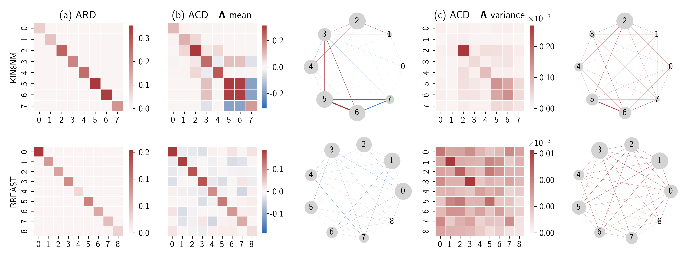

# Sparse Bayesian Gaussian Process (BSGP) with Bayesian Inference of Covariate Couplings

This is the repository for the work on Sparse GPs with Bayesian inference of covariate couplings: we develop covariances characterized by affine transformations of the inputs, formalized via a precision matrix between covariates, which can uncover covariate couplings for enhanced interpretability. We study a range of couplings priors from Wishart to Horseshoe and present fully Bayesian inference of such precision matrices within sparse Gaussian process. We name this approach Automatic Coupling Determination (ACD)



## Features

- **Sparse GP inference**: We build on the work by Rossi et al. on Bayesian Sparse Gaussian Processes to obtain samples from the posterior distribution over the Cholesky decomposition of a (Full) RBF kernel precision matrix to capture covariate couplings.  
- **A wide range of priors over matrices**: Support for Wishart, Horseshoe, and other sparsity-inducing priors.
- **Interpretability**: We enhance the interpretability provided by Automatic Relevance Determination (ARD) technique by retrieving meaningful couplings among the input covariates.

## Installation

```bash
git clone https://github.com/mattyred/BayesianSGP_Covariate_Couplings_Determination.git
cd BayesianSGP_Covariate_Couplings_Determination
pip install -r requirements.txt
```

## Reproduce results

```bash
python train_bsgp_kfold.py \
  --experiment EXP_NAME \
  --model BSGP \
  --dataset boston \
  [--use_wandb] \
  [--num_inducing 500] \
  [--pca_latents -1]
```

**Arguments**

- `--experiment EXP_NAME`: Name of the JSON file (without .json) in `./experiments/` that holds your experiment config. E.g. if you have `./experiments/acd_wishart.json`, use --experiment acd_wishart.
- `--model {BSGP,BGP}` Choose your model type:
    - BSGP: Bayesian Sparse GP with adaptive SGHMC
    - BGP: Full GP (no low rank formulation with inducing points)
- `--dataset {boston,kin8nm,powerplant,concrete,breast,eeg,wilt,diabetes}`
- `--use_wandb` (flag): If present, metrics and artifacts will be logged to Weights & Biases. Requires you to have wandb installed and logged in.
- `--num_inducing N`: Number of inducing points (default: 500).
- `--pca_latents D`: If ≥0, project inputs down to `D` PCA dimensions prior to training (default: –1 to disable).

**Example**

```bash
# run with BSGP with 500 inducing points and Wishart prior over the (Full) RBF kernel precision matrix, no PCA, logging to wandb
python train_bsgp_kfold.py --experiment acd_wishart --model BSGP --dataset kin8nm --use_wandb
```

This will:

1) Load `defaults.json` and `experiments/acd_wishart.json` 

2) Initialize your model & sampler

3) Perform adaptive SGHMC sampling using a Wishart prior on the precision matrix we want to get samples from.

4) Save samples & metrics under `./results/run-XXXX/`

5) (If --use_wandb) upload metrics and .npz artifacts to your W&B project
